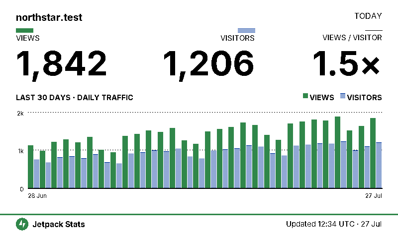
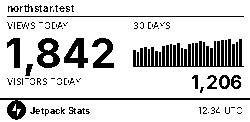
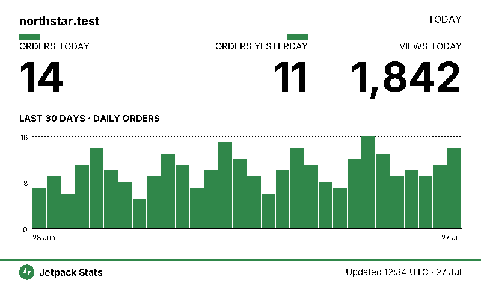

# Stats on Paper

Put a WordPress.com or Jetpack site’s stats on e-ink displays from 2.13 to
10.3 inches.



> **Status:** early alpha. The companion tutorial is not published yet, and the
> JSON contract may still change.

After `sop login`, the app is four small commands, and each one is a useful
exit ramp on its own:

* `sop fetch` prints a portable JSON snapshot of your stats;
* `sop render` turns that snapshot into a native-size PNG — no hardware needed;
* `sop display` pushes a rendered image to a locally attached panel;
* `sop serve` exposes the JSON and PNG over HTTP for TRMNL or any other
  remote consumer.

You can stop after `fetch` if you only want the data, or after `render` if a
PNG is the final output. Nothing before `display` requires buying a panel.

## Render profiles

| Profile | Native canvas | Palette | Status |
| --- | --- | --- | --- |
| `waveshare-2in13` | 250×122 | Black/white | Render only |
| `waveshare-2in13-four-color` | 250×122 | Black/white/red/yellow | Render only |
| `impression-4in0` | 600×400 | Spectra 6 | Adapter written, hardware untested |
| `waveshare-4in26` | 800×480 | Black/white | Adapter written, driver packaging unresolved |
| `waveshare-4in26-four-color` | 800×480 | Black/white/red/yellow | Render only |
| `impression-7in3` | 800×480 | Spectra 6 | Adapter written, hardware untested |
| `waveshare-10in3` | 1872×1404 | Four-level grayscale | Render only |
| `trmnl` | 800×480 | Black/white | Polling target for the TRMNL device |

“Render only” means the profile produces a correct native-size image, but this
repository does not yet ship a driver for that panel.



## Getting started

You need Python 3.11+ and [uv](https://docs.astral.sh/uv/):

```console
git clone https://github.com/Automattic/stats-on-paper.git
cd stats-on-paper
uv sync --locked
cp .env.example .env
```

### Get WordPress.com API credentials

Stats are fetched through the WordPress.com REST API, which requires a (free)
OAuth application:

1. Open the [WordPress.com Applications Manager](https://developer.wordpress.com/apps/)
   and create a new application. Name and description are up to you; the
   website URL can be your site.
2. Set the redirect URL to exactly `http://localhost/callback` (or another URL
   you control — it must match `WPCOM_REDIRECT_URI` in your `.env` character
   for character).
3. Copy the client ID and client secret into `.env` as `WPCOM_CLIENT_ID` and
   `WPCOM_CLIENT_SECRET`, and set `WPCOM_SITE` to your site’s domain or
   numeric ID.

Then authorize once:

```console
uv run sop login --manual
```

`sop` prints an authorization URL. Open it, approve access for your site, and
paste the full URL you are redirected to back into the terminal. The token is
stored privately in `~/.config/sop/token.json`. By default the app requests
the narrow `stats` scope for that one site and verifies the grant actually
covers it; set `WPCOM_SCOPE=global` before logging in if you want a single
token that works across every site your account can access (broader access,
but you can then change `WPCOM_SITE` without authorizing again).

For several sites, either use one global token and vary `WPCOM_SITE`, or keep
a separate least-privilege token per site and select it with
`SOP_TOKEN_PATH`:

```console
SOP_TOKEN_PATH=~/.config/sop/token-example.com.json \
  WPCOM_SITE=example.com uv run sop fetch
```

### Fetch, render, serve

```console
uv run sop fetch
uv run sop render --panel impression-7in3 -o out.png
uv run sop serve
```

`sop serve` exposes `GET /v1/stats.json` and `GET /v1/screen.png?panel=<profile>`
on localhost. Set `SOP_SERVE_TOKEN` to require a bearer token — without one the
server refuses to bind to anything but localhost. Both routes send ETags, so a
polling client can skip identical frames. This is Flask’s development server;
put a real HTTPS proxy in front of it before exposing it anywhere public.

For TRMNL, see [`trmnl/README.md`](trmnl/README.md): it carries the private
plugin's polling settings and four ready-made Liquid layouts. Pointing a plugin
at `/v1/screen.png?panel=trmnl` for a ready-made 800×480 image also works, and
is how the commerce screen reaches a TRMNL.

Snapshots are cached for an hour by default (`SOP_POLL_INTERVAL_SECONDS`). The
figures are daily, so there is nothing to gain from polling faster; fifteen
minutes is a sensible floor and hours are fine. E-ink panels take around 20
seconds to physically refresh, which is a redraw duration, not a polling rate.

### Configuration

Everything is read from `.env`; `.env.example` lists every variable. The ones
you are most likely to change:

- `SOP_SOURCE=direct|url` — read WordPress.com directly, or poll another
  `sop serve` instance at `SOP_SOURCE_URL`.
- `SOP_TZ` — the site's timezone, so "today" rolls over when the site's day
  does (default `UTC`).
- `SOP_SERIES_DAYS` — how many daily points to fetch (default 30). A panel
  draws as many of the most recent days as it can show legibly and captions
  exactly that window.
- `SOP_CACHE_DIR` — where the last snapshot is kept (default `~/.cache/sop`).
- `SOP_VIEW` — which screen to draw, `stats` or `commerce` (default `stats`).
- `SOP_PANEL` — which panel `render` and `display` target, so a device is
  configured once rather than passed on every command.
- `SOP_COMMERCE` — fetch the WooCommerce order series. `SOP_VIEW=commerce`
  needs it set on whichever process does the fetching.

Both `SOP_VIEW` and `SOP_PANEL` are plain environment variables, which is what
a fleet tool such as balena sets per device, so switching a screen remotely
needs nothing else from this app.

## Screens

`stats` is the default: views, visitors, views per visitor, and a daily chart.

`commerce` shows orders today and yesterday beside views, over a daily orders
chart. It needs `SOP_COMMERCE=true` and a site with a store.



```console
uv run sop render --view commerce --panel impression-7in3 -o orders.png
```

### Display on a panel

```console
uv run sop display --panel impression-7in3
```

Hardware is required only for this command, and hardware support is the least
proven part of the project: the Inky and Waveshare adapters exist but have not
run against physical panels from this checkout, and the optional `inky` extra
does not currently install cleanly on ARM from wheels alone. Treat `display`
as experimental until this notice is removed.

## License

Licensed under GPL-2.0-or-later. Bundled fonts and product marks have their own
attribution and trademark notes in [`COPYRIGHT.md`](COPYRIGHT.md).
